# Report for Assignment 1

## Project chosen

Name: mypy

URL: https://github.com/python/mypy

Number of lines of code and the tool used to count it: 86.419 KLOC counted using lizard

Programming language: Python

## Coverage measurement

### Existing tool

<Inform the name of the existing tool that was executed and how it was executed>

Tool: Pytest-cov which uses coverage.py under the hood (it says coverage.py v7.3.2 in the screenshot)

Command: python -m pytest -q --cov mypy --cov-config .coveragerc --cov-report=term-missing --cov-report=html

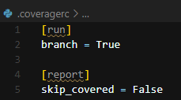

<Show the coverage results provided by the existing tool with a screenshot>

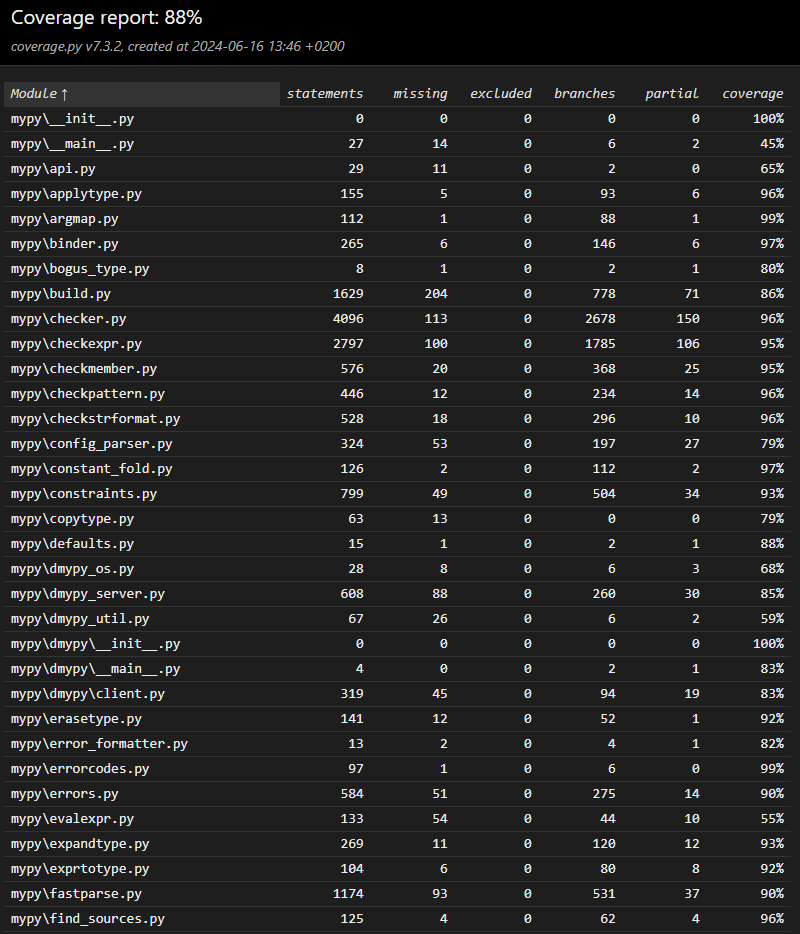
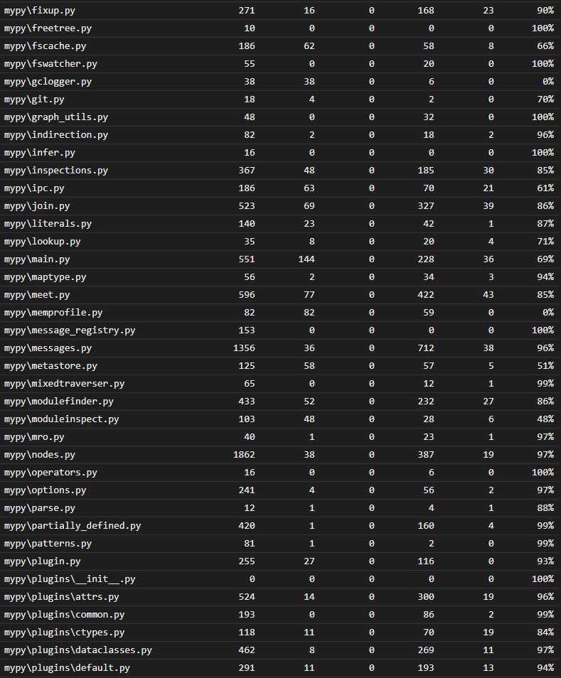
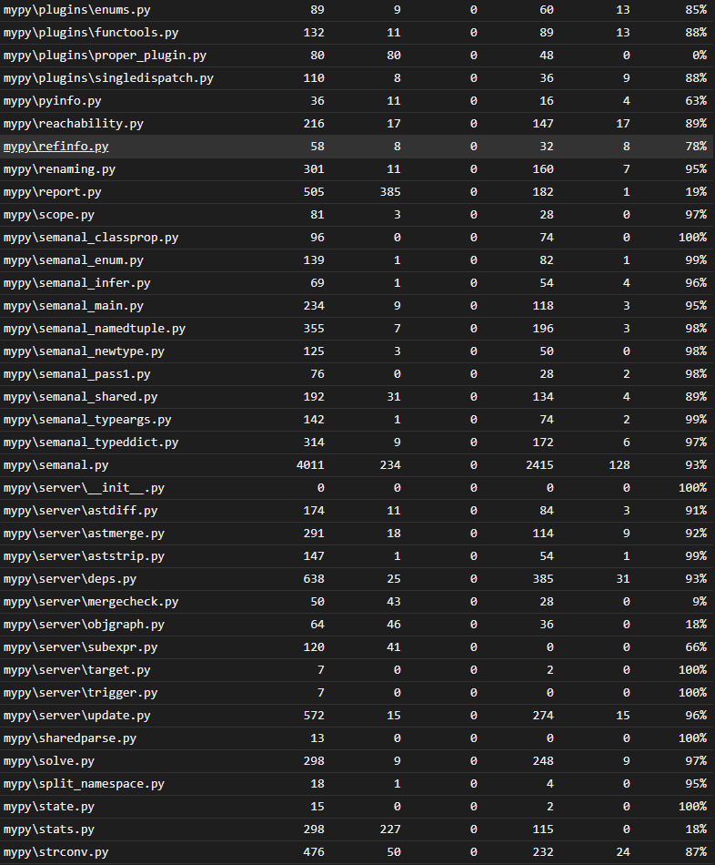
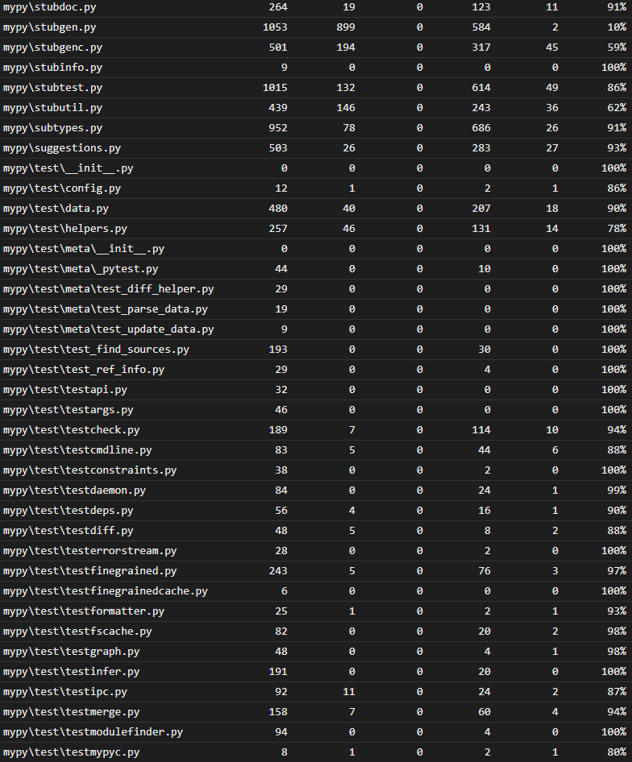
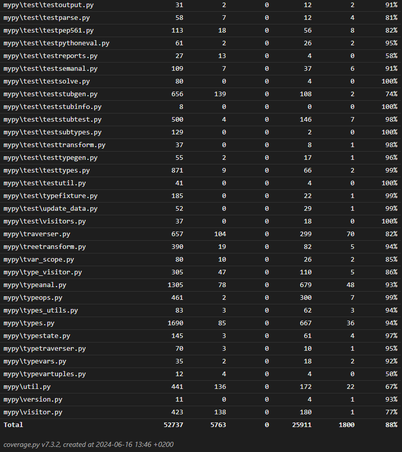

### Your own coverage tool

<The following is supposed to be repeated for each group member>

<Group member name> 

<Function 1 name> 

<Show a patch (diff) or a link to a commit made in your forked repository that shows the instrumented code to gather coverage measurements>

<Provide a screenshot of the coverage results output by the instrumentation>

<Function 2 name>

<Provide the same kind of information provided for Function 1>

#### Shane Prent (Goose-9 on Github)

<!--Function 1-->

visit_deleted_type() in mypy/meet.py

Coverage tool implemented in mypy/meet_with_coverage.py as it allowed for a better printing system and code organisation. The function visit_deleted_type() in meet_with_coverage.py is a copy/overridden version of the same function in mypy/meet.py

https://github.com/python/mypy/commit/e63f6189d20e5663f18001252845db82c6a6c875

Coverage results output can also be seen in [test_visit_deleted_output.txt](test_visit_deleted_output.txt)

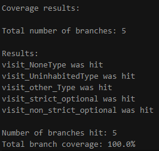

<!--Function 2-->

visit_type_var_tuple() in mypy/meet.py

Coverage tool implemented in mypy/meet_with_coverage.py as it again allowed for a better printing system and code organisation. The function visit_type_var_tuple() in meet_with_coverage.py is a copy/overridden version of the same function in mypy/meet.py

https://github.com/python/mypy/commit/e63f6189d20e5663f18001252845db82c6a6c875

Coverage results output can also be seen in [test_visit_var_tuple_output.txt](test_visit_var_tuple_output.txt)

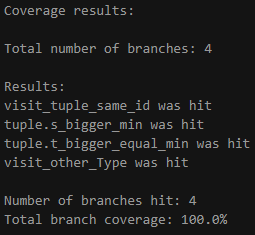

#### Justin Prent (JustinPrent on Github)

<get_line_rate()> in mypy/report.py

The link below shows the comparison between my working branch and the original master branch. It also includes the pretty print used to create the coverage output:

NB! Only lines 130-158 of mypy/report.py are relevant to this function.   
https://github.com/exegeist/sep-mypy/compare/master...exegeist:sep-mypy:Justin-working

Coverage results output can be seen in [test_line_rate.txt](test_line_rate.txt)

*Results of Test:*

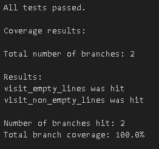

<should_skip_path()> in mypy/report.py

The link below shows the comparison between my working branch and the original master branch. It is the same link given in the function above:

NB! Only lines 595-620 of mypy/report.py are relevant to this function.     
https://github.com/exegeist/sep-mypy/compare/master...exegeist:sep-mypy:Justin-working

Coverage results output can be seen in [test_skip_path.txt](test_skip_path.txt)

*Results of Test:*

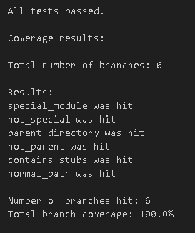

## Coverage improvement

### Individual tests

<The following is supposed to be repeated for each group member>

<Group member name>

<Test 1>

<Show a patch (diff) or a link to a commit made in your forked repository that shows the new/enhanced test>

<Provide a screenshot of the old coverage results (the same as you already showed above)>

< Provide a screenshot of the new coverage results>

< State the coverage improvement with a number and elaborate on why the coverage is improved>

<Test 2>

<Provide the same kind of information provided for Test 1>

#### Shane Prent (Goose-9 on Github)

<!--Test 1-->

Test file name: [mypy/test/test_visit_deleted.py](mypy/test/test_visit_deleted.py)

New test created to test the function visit_deleted_type in meet_with_coverage.py.

https://github.com/python/mypy/commit/ea6ae9075c7a9d5a4eec15020409b64eba4a3fa1

Old coverage results for visit_deleted_type(): 

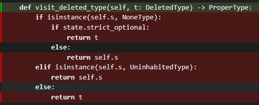

*Coverage is 0% for statement and branch coverage*

New coverage results for visit_deleted_type(): 

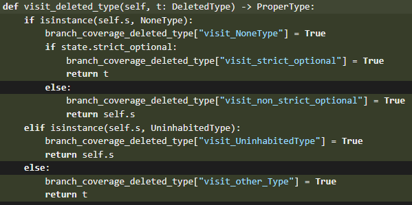

*Coverage is 100% for statement and branch coverage (measured using own tool and coverage.py)*

The total coverage improvement is 100%, as both the statement and branch coverage increased from 0% in the original function to 100% after the test was added. The coverage increased as the test caused all the different branches in the main function to run and checks the output of the function to make sure it is correct. As every statement is run in the function, the statement coverage is 100% and likewise, since all the branches are accounted for and run, the branch coverage is also 100%.

<!--Test 2-->

Test file name: [mypy/test/test_visit_var_tuple.py](mypy/test/test_visit_var_tuple.py)

New test created to test the function visit_type_var_tuple in meet_with_coverage.py.

https://github.com/python/mypy/commit/0a938d60da9fc923b9f9e7a67400b72b7c770f30

Old coverage results for visit_type_var_tuple(): 

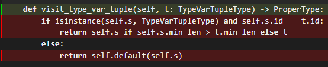

*Coverage is 0% for statement and branch coverage*

New coverage results for visit_type_var_tuple(): 

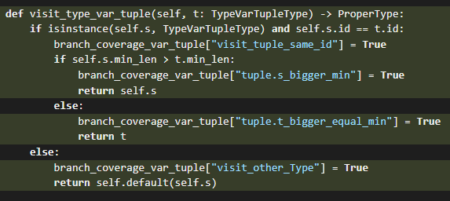

*Coverage is 100% for statement and branch coverage (measured using own tool and coverage.py)*

The total coverage improvement is 100%, as both the statement and branch coverage increased from 0% in the original function to 100% after the test was added. The coverage increased as the test caused all the different branches in the main function to run and checks the output of the function to make sure it is correct. As every statement is run in the function, the statement coverage is 100% and likewise, since all the branches are accounted for and run, the branch coverage is also 100%.

*Disclaimer: As explained in the "Coverage improvement" section, the result of the coverage improvement is run on the meet_with_coverage.py file and not meet.py. This is because, I decided to copy/inherit the original function from meet.py and implement my coverage tool in a new file meet_with_coverage.py. Thus the tests run on the new functions in meet_with_coverage.py. The reasons for this is that it allowed me to create a pretty print function and keep all my changes in one file so that it is easy to see what I implemented. This means that the coverage improvement is shown over the meet_with_coverage.py file and not over the original meet.py file as shown below:*

### Justin Prent (JustinPrent on Github)

<Test 1>

Test file name: [mypy/test/test_line_rate.py](mypy/test/test_line_rate.py)

New test created to test the function get_line_rate() in mypy/report.py.

NB! Only the file "mypy/test/test_line_rate.py" is relevant to this section.  
https://github.com/exegeist/sep-mypy/compare/master...exegeist:sep-mypy:Justin-working 

#### Old coverage results for get_line_rate():  
*Coverage is 0% for statement and branch coverage*

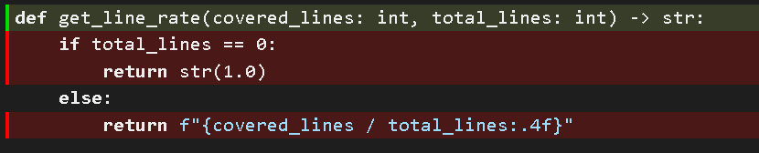

#### New coverage results for get_line_rate(): 

//TODO add screenshot of new coverage and explanation

<Test 2>

Test file name: [mypy/test/test_skip_path.py](mypy/test/test_skip_path.py)

New test created to test the function should_skip_path() in mypy/report.py.

NB! Only the file "mypy/test/test_skip_path.py" is relevant to this section.  
https://github.com/exegeist/sep-mypy/compare/master...exegeist:sep-mypy:Justin-working 

#### Old coverage results for should_skip_path():  
*Coverage is 0% for statement and branch coverage*

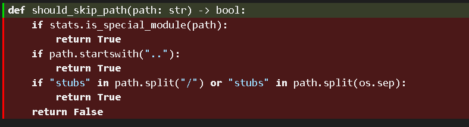

#### New coverage results for should_skip_path(): 

//TODO add screenshot of new coverage and explanation

### Overall

<Provide a screenshot of the old coverage results by running an existing tool (the same as you already showed above)>

<Provide a screenshot of the new coverage results by running the existing tool using all test modifications made by the group>

Command to run: python -m pytest -q --cov mypy --cov-config .coveragerc --cov-report=term-missing --cov-report=html

#### Before:

#### After:

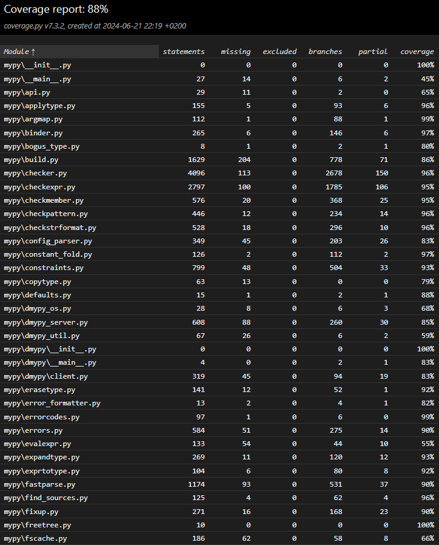
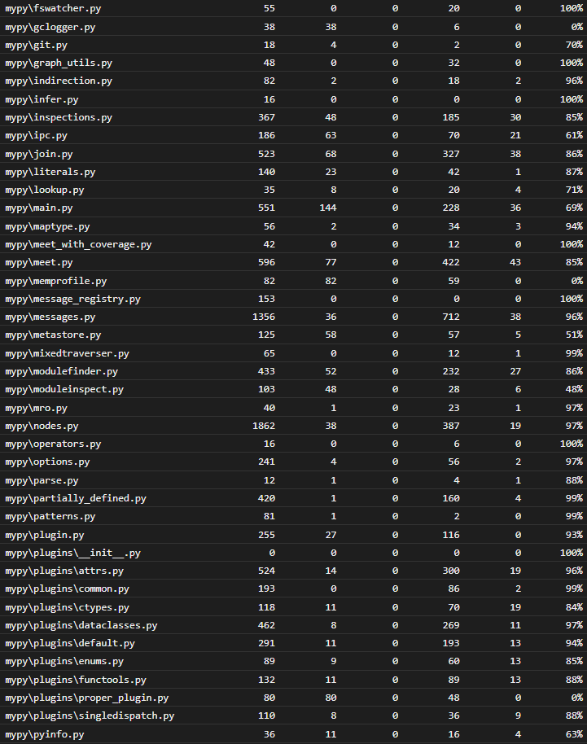
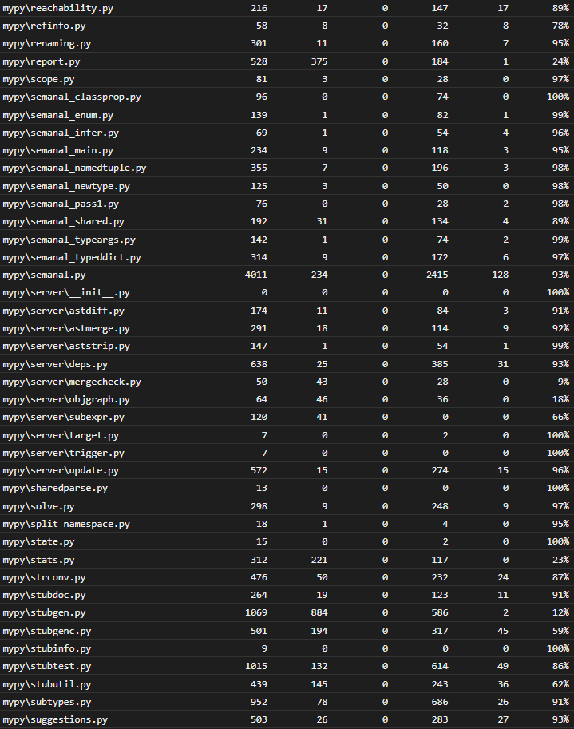
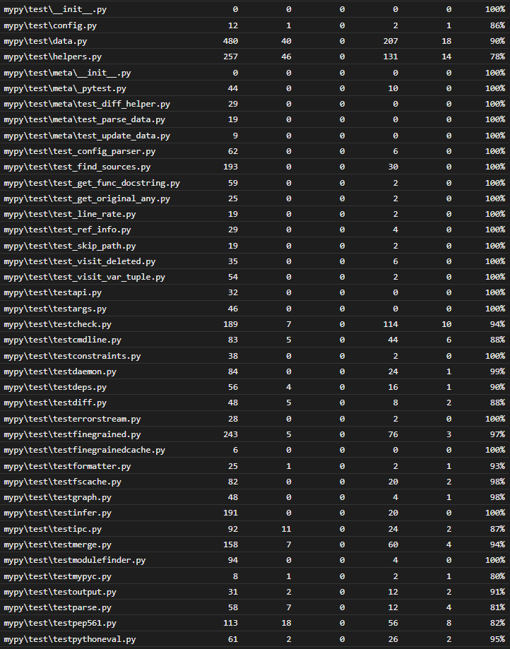
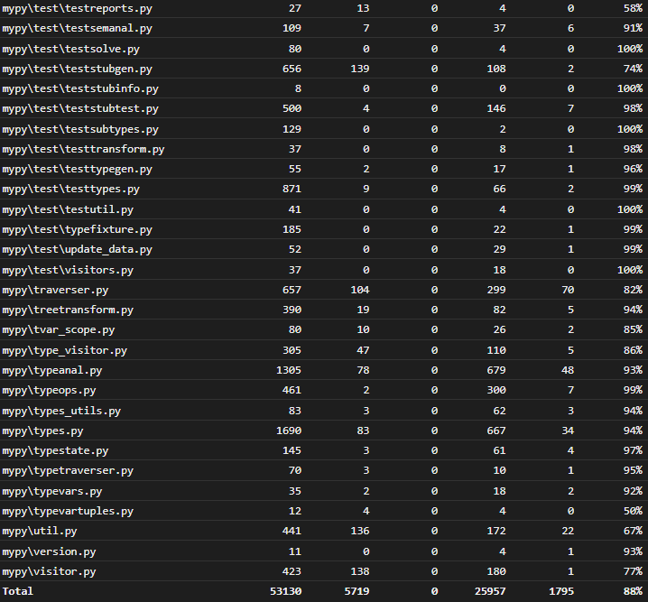

## Statement of individual contributions

<Write what each group member did>

#### Shane Prent (Goose-9 on Github):
- Created pretty print and manipulation of the output buffer to allow for the groups coverage tool to be outputted and saved to a file when running tests.
- Completed project information section in the report, as well as completing the full coverage reports seen in this document.
- Implemented a coverage tool on 2 different functions with, originally, 0% coverage.
- Created a test for each of the 2 functions, resulting in a coverage improvement (statement and branch) of 100% over the 2 functions.
- Completed the relevant sections in the report under the name Shane Prent

#### Justin Prent (JustinPrent on Github):
- Implemented an original coverage tool on 2 different functions, which originally had 0% coverage. 
- Created a test for each of the 2 functions, ensuring coverage over every branch and statement, while also testing the logic of each function further to ensure correctness. This resulted in a coverage of 100% over the 2 functions.
- Completed the relevant sections in the report under the name Justin Prent.
