# Report for Assignment 1

## Project chosen

Name: mypy

URL: https://github.com/python/mypy

Programming language: Python

Lines of code: 86,419 (counted with lizard)

## Coverage measurement

### Existing tool

The project already had an existing tool integrated already: [pytest-cov](https://github.com/pytest-dev/pytest-cov), with [coverage.py](https://github.com/nedbat/coveragepy) (v7.3.2) under the hood. We ran the following command to create an initial coverage report:

```
python -m pytest -q --cov mypy --cov-config .coveragerc --cov-report=term-missing --cov-report=html
```


The initial results:


### Our own coverage tool

#### Shane Prent (Goose-9 on GitHub)

Function 1: `visit_deleted_type()` in `mypy/meet.py`

Coverage tool implemented in `mypy/meet_with_coverage.py` as it allowed for a better printing system and code organisation. The function `visit_deleted_type()` in `meet_with_coverage.py` is a copy/overridden version of the same function in `mypy/meet.py`

https://github.com/python/mypy/commit/e63f6189d20e5663f18001252845db82c6a6c875

Coverage results output can also be seen in [test_visit_deleted_output.txt](test_visit_deleted_output.txt):


Function 2: `visit_type_var_tuple()` in `mypy/meet.py`

Coverage tool implemented in `mypy/meet_with_coverage.py` as it again allowed for a better printing system and code organisation. The function `visit_type_var_tuple()` in `meet_with_coverage.py` is a copy/overridden version of the same function in `mypy/meet.py`

https://github.com/python/mypy/commit/e63f6189d20e5663f18001252845db82c6a6c875

Coverage results can be seen in [test_visit_var_tuple_output.txt](test_visit_var_tuple_output.txt):


#### Justin Prent (JustinPrent on GitHub)

Function 1: `get_line_rate()` in `mypy/report.py`

The link below shows the comparison between my working branch and the original master branch. It also includes the pretty print used to create the coverage output:

N.B. Only lines 130-158 of `mypy/report.py` are relevant to this function.
https://github.com/exegeist/sep-mypy/compare/master...exegeist:sep-mypy:Justin-working

Coverage results can be seen in [test_line_rate.txt](test_line_rate.txt):


Function 2: `should_skip_path()` in `mypy/report.py`

The link below shows the comparison between my working branch and the original master branch. It is the same link given in the function above:

N.B. Only lines 595-620 of `mypy/report.py` are relevant to this function.
https://github.com/exegeist/sep-mypy/compare/master...exegeist:sep-mypy:Justin-working

Coverage results can be seen in [test_skip_path.txt](test_skip_path.txt):


#### Martin Oltmann (exegeist on GitHub)

Function 1: `str_or_array_as_list()` in `mypy/config_parser.py`

Here is the comparison between my working branch and the original master branch which shows the changes I made to instrument the function and write the associated unit tests to improve coverage.

https://github.com/exegeist/sep-mypy/compare/master...exegeist:sep-mypy:Martin-working

Coverage results can be seen in [test_str_or_array_as_list.txt](test_str_or_array_as_list.txt):

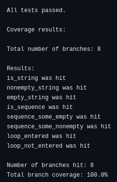

Function 2: `convert_to_boolean()` in `mypy/config_parser.py`

Here is the comparison between my working branch and the original master branch which shows the changes I made to instrument the function and write the associated unit tests to improve coverage.

https://github.com/exegeist/sep-mypy/compare/master...exegeist:sep-mypy:Martin-working

Coverage results can be seen in [test_convert_to_boolean.txt](test_convert_to_boolean.txt):

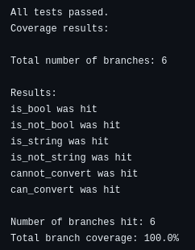

#### Luciano Monteiro (Luciman848484 on GitHub)

Function 1: `get_original_any()` in `mypy/stats.py`

Here is the comparison between my working branch and the original master branch which shows the changes I made to instrument the function and write the associated unit tests to improve coverage.

https://github.com/exegeist/sep-mypy/compare/master...exegeist:sep-mypy:Luciano's-branch

Coverage results can be seen in [test_get_original_any_output.txt](test_get_original_any_output.txt):

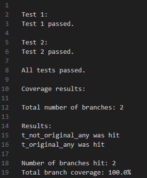

Function 2: `_get_func_docstring()` in `mypy/subgen.py`

Here is the comparison between my working branch and the original master branch which shows the changes I made to instrument the function and write the associated unit tests to improve coverage.

https://github.com/exegeist/sep-mypy/compare/master...exegeist:sep-mypy:Luciano's-branch

Coverage results can be seen in [test_get_func_docstring.txt](test_get_func_docstring.txt):

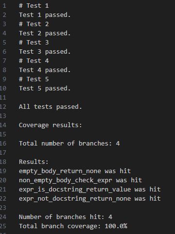

## Coverage improvement

### Individual tests

#### Shane Prent (Goose-9 on GitHub)

Test 1: [mypy/test/test_visit_deleted.py](mypy/test/test_visit_deleted.py)

New test created to test the function `visit_deleted_type()` in `meet_with_coverage.py`.

https://github.com/python/mypy/commit/ea6ae9075c7a9d5a4eec15020409b64eba4a3fa1

Old coverage results for `visit_deleted_type()`:


*Coverage is 0% for statement and branch coverage*

New coverage results for `visit_deleted_type()`:


*Coverage is 100% for statement and branch coverage (measured using own tool and coverage.py)*

The total coverage improvement is 100%, as both the statement and branch coverage increased from 0% in the original function to 100% after the test was added. The coverage increased as the test caused all the different branches in the main function to run and checks the output of the function to make sure it is correct. As every statement is run in the function, the statement coverage is 100% and likewise, since all the branches are accounted for and run, the branch coverage is also 100%.

Test 2: [mypy/test/test_visit_var_tuple.py](mypy/test/test_visit_var_tuple.py)

New test created to test the function `visit_type_var_tuple()` in `meet_with_coverage.py`.

https://github.com/python/mypy/commit/0a938d60da9fc923b9f9e7a67400b72b7c770f30

Old coverage results for `visit_type_var_tuple()`:


*Coverage is 0% for statement and branch coverage*

New coverage results for `visit_type_var_tuple()`:


*Coverage is 100% for statement and branch coverage (measured using own tool and coverage.py)*

The total coverage improvement is 100%, as both the statement and branch coverage increased from 0% in the original function to 100% after the test was added. The coverage increased as the test caused all the different branches in the main function to run and checks the output of the function to make sure it is correct. As every statement is run in the function, the statement coverage is 100% and likewise, since all the branches are accounted for and run, the branch coverage is also 100%.

*Disclaimer: As explained in the "Coverage improvement" section, the result of the coverage improvement is run on the meet_with_coverage.py file and not meet.py. This is because, I decided to copy/inherit the original function from meet.py and implement my coverage tool in a new file meet_with_coverage.py. Thus, the tests run on the new functions in meet_with_coverage.py. The reasons for this is that it allowed me to create a pretty print function and keep all my changes in one file so that it is easy to see what I implemented. This means that the coverage improvement is shown over the meet_with_coverage.py file and not over the original meet.py file as shown below:*


#### Justin Prent (JustinPrent on GitHub)

Test 1: [mypy/test/test_line_rate.py](mypy/test/test_line_rate.py)

New test created to test the function `get_line_rate()` in `mypy/report.py`.

N.B. Only the file `mypy/test/test_line_rate.py` is relevant to this section.
https://github.com/exegeist/sep-mypy/compare/master...exegeist:sep-mypy:Justin-working

Old coverage results for `get_line_rate()`:

*Coverage is 0% for statement and branch coverage*


New coverage results for `get_line_rate()`:

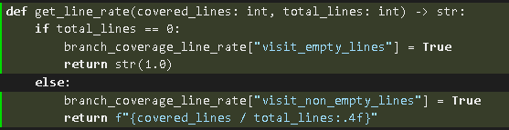

*Coverage is 100% for statement and branch coverage (measured using own tool and coverage.py)*

The total coverage for the function get_line_rate() increased from 0% in the original function to 100% after the tests were added. The coverage increased as the new created test caused all the different branches in the function to be run and checks that the output is correct. Therefore, as every statement is run in the function, the statement coverage is 100% and since all other branches are accounted for and run, the branch coverage is also 100%. Since we added more lines to the actual function, the final coverage for the whole file will be affected by these extra statements and "pretty-print" functions, but it should not affect the  coverage drastically.

N.B. The final difference in the coverage over the whole file mypy/report.py is given below both tests!

Test 2: [mypy/test/test_skip_path.py](mypy/test/test_skip_path.py)

New test created to test the function `should_skip_path()` in `mypy/report.py`.

N.B. Only the file `mypy/test/test_skip_path.py` is relevant to this section.
https://github.com/exegeist/sep-mypy/compare/master...exegeist:sep-mypy:Justin-working

Old coverage results for `should_skip_path()`:
*Coverage is 0% for statement and branch coverage*


New coverage results for `should_skip_path()`:

*Coverage is 100% for statement and branch coverage (measured using own tool and coverage.py)*

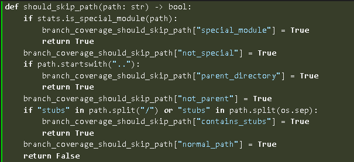

The total coverage for the function should_skip_path() increased from 0% in the original function to 100% after the tests were added. The coverage increased as the new created test caused all the different branches in the function to be run and checks that the output is correct. Therefore, as every statement is run in the function, the statement coverage is 100% and since all other branches are accounted for and run, the branch coverage is also 100%. Since we added more lines to the actual function, the final coverage for the whole file will be affected by these extra statements and "pretty-print" functions, but it should not affect the  coverage drastically.

*Final coverage before and after for mypy/report.py:*

Before:


After:


NB! This 5% increase in coverage is affected by the newly added statements to the functions and relevant "pretty-print" functions that were added to the file.

#### Martin Oltmann (exegeist on GitHub)

Test 1: [mypy/test/test_config_parser.py](mypy/test/test_config_parser.py)

New test created to test the function `str_or_array_as_list()` in `mypy/config_parser.py`.

https://github.com/exegeist/sep-mypy/compare/master...exegeist:sep-mypy:Martin-working

Old coverage results for `str_or_array_as_list()`:

*Coverage is 0% for statement and branch coverage*

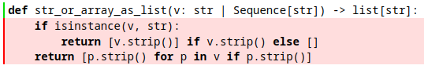

New coverage results for `str_or_array_as_list()`:

*Coverage is 100% for statement and branch coverage (measured using own tool and coverage.py)*

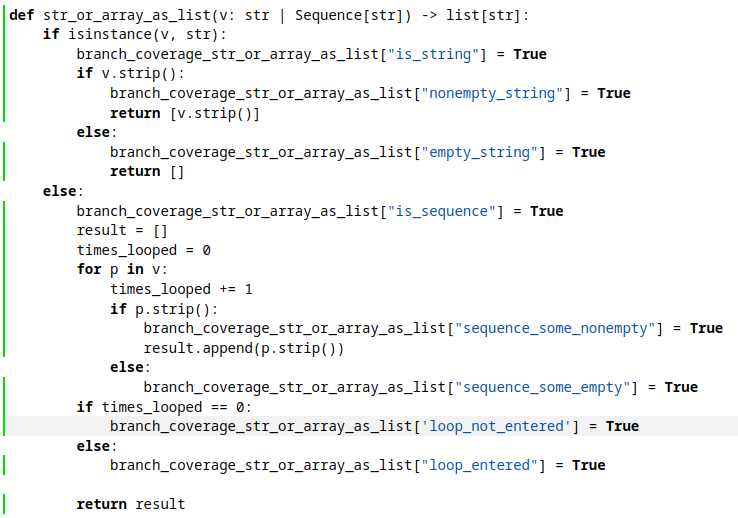

Initially, none of the branches or statements were covered by the tests. I mapped the function's branches like below, instrumented the function to track each branch, and wrote unit tests to raise coverage to 100%.

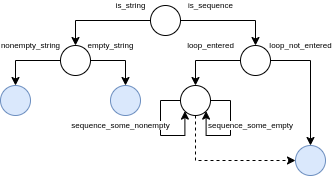

Test 2: [mypy/test/test_config_parser.py](mypy/test/test_config_parser.py)

New test created to test the function `convert_to_boolean()` in `mypy/config_parser.py`.

https://github.com/exegeist/sep-mypy/compare/master...exegeist:sep-mypy:Martin-working

Old coverage results for `convert_to_boolean()`:

*Coverage is very low for statement and branch coverage*

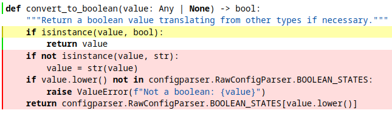

New coverage results for `convert_to_boolean()`:

*Coverage is 100% for statement and branch coverage (measured using own tool and coverage.py)*

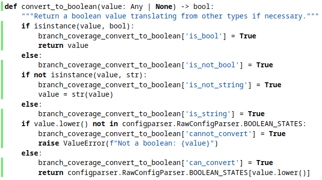

Initially, only one of the six branches was covered by the tests. I mapped the function's branches like below, instrumented the function to track each branch, and wrote unit tests to raise coverage to 100%.

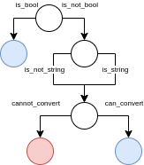

Before:

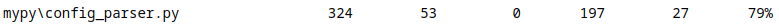

After:

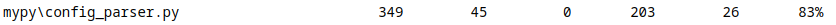

#### Luciano Monteiro (Luciman8484 on GitHub)

Test 1: [mypy/test/test_get_original_any.py](mypy/test/test_get_original_any.py)

New test created to test the function `get_original_any()` in `mypy/stats.py`.

https://github.com/exegeist/sep-mypy/compare/master...exegeist:sep-mypy:Luciano's-branch

Old coverage results for `get_original_any()`:

*Coverage is 0% for statement and branch coverage*

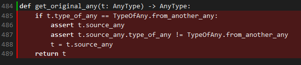

New coverage results for `get_original_any()`:

*Coverage is 100% for statement and branch coverage (measured using own tool and coverage.py)*

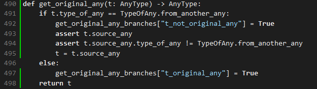

Test 2: [mypy/test/test_get_func_docstring.py](mypy/test/test_get_func_docstring.py)

New test created to test the function `_get_func_docstring()` in `mypy/stubgen.py`.

https://github.com/exegeist/sep-mypy/compare/master...exegeist:sep-mypy:Luciano's-branch

Old coverage results for `_get_func_docstring()`:

*Coverage is 0% for statement and branch coverage*

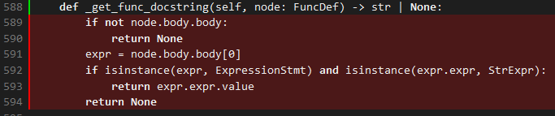

New coverage results for `_get_func_docstring()`:

*Coverage is 100% for statement and branch coverage (measured using own tool and coverage.py)*

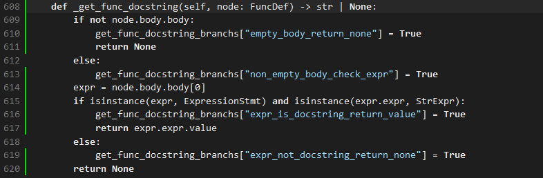


### Overall

Command used:

```python -m pytest -q --cov mypy --cov-config .coveragerc --cov-report=term-missing --cov-report=html```


#### Before:


#### After:


## Statement of individual contributions

#### Shane Prent (Goose-9 on GitHub):
- Created pretty print and manipulation of the output buffer to allow for the groups coverage tool to be outputted and saved to a file when running tests.
- Completed project information section in the report, as well as completing the full coverage reports seen in this document.
- Implemented a coverage tool on 2 different functions with, originally, 0% coverage.
- Created a test for each of the 2 functions, resulting in a coverage improvement (statement and branch) of 100% over the 2 functions.
- Completed the relevant sections in the report under the name Shane Prent

#### Justin Prent (JustinPrent on GitHub):
- Implemented an original coverage tool on 2 different functions, which originally had 0% coverage.
- Created a test for each of the 2 functions, ensuring coverage over every branch and statement, while also testing the logic of each function further to ensure correctness. This resulted in a coverage of 100% over the 2 functions.
- Completed the relevant sections in the report under the name Justin Prent.

#### Martin Oltmann (exegeist on GitHub):
- Created the forked repository along with the WhatsApp and Discord group chats.
- Implemented through instrumentation an original coverage tool on 2 functions which originally had 0% coverage.
- Created unit tests for each of the 2 functions, ensuring coverage over every branch and statement, while simultaneously testing the logic of each function further to ensure correctness, resulting in a 100% coverage over the 2 functions.
- Completed the relevant sections in the report under the name Martin Oltmann.

#### Luciano Monteiro (Luciman8484 on GitHub):
- Ran an initial coverage test to identify untested functions
- Created tests for all branches in each function
- Added tests for each individual branch, ensuring coverage of every possible outcome
- Compared newly implemented tests with the old coverage to assess improvements
- Completed the relevant sections in the report under the name Luciano Monteiro.
